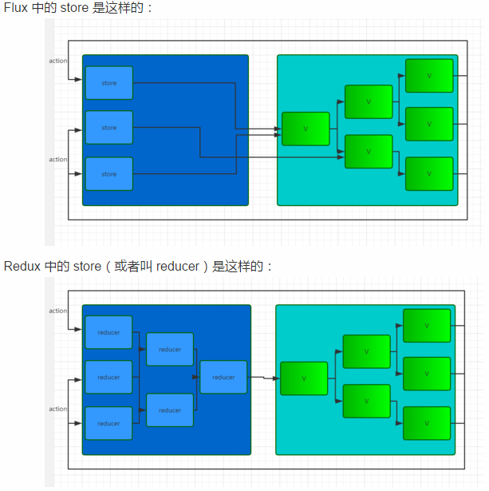

## React
React 是一个view层框架，用来渲染视图，他主要做一下事情
 - 组件化
 - 利用props形成单向数据流
 - 利用虚拟DOM 提升渲染性能

React 能够根据state的变化来更新view，一般来说引起state变化的动作除了来自外部（如服务器），大部分来紫玉页面上的用户活动，那页面试试那个用户活动怎样对state产生作用？React中每个组件都有setstate方法用于改变组件当前的state，所以可以把更改组件的逻辑写在各自组件里，但这样的问题在于，当项目逻辑变得越来越复杂的时候，将很难清理state跟view之间的对应关系（一个state的变化可能引起多个view的变化，一个view上面触发的事件可能引起多个state的改变）。我们需要对所有引起state变化 的情况进行统一管理，于是就有了flux。

## Flux
  flux 是一种应用架构，或者说是一种思想，它跟react本身没什么关系，它可以用在react上，也可以用在别
框架上。前面说到flux在React中主要用来统一管理引起state变化的情况。Flux维护着一个或者多个store的变量，就像MVC里面的model，里面存放着应用用到的所有数据，当一个事件触发时，flux对事件进行处理，对store进行更新。这里的controller view可以有多个也可以不是根组件，但是这样数据流维护起来就比较麻烦。
flux思维图：
![]（flux.pag）

  flux主要包括四个部分，Dispatcher、store、view、action，其中dispatcher是flux的核心枢纽，它相于一个事件分发器，将那些分散在各个组件里面的逻辑代码收集起来，统一在dispatcher中进行处理。完整的流程是这样的：用户通过与view交互或外部产生一个action，dispacther接收到action并执行那些已经注册的回调，向所有store分发action。通过注册回调，store响应那些与他们所保存的状态有关的action。然后store会触发一个change事件，来提醒controller-views数据已经发生改变。controller-views监听这些事件，并重新重store中获取数据。这些controller-views调用他们自己的setState方法,重新渲染自身以及组件树上所有的后代组件。使用flux有个好处就是我们只需要用action对象向dispacther描述当前事件就可以执行对应的逻辑，因为dispacther是所有action的处理中心，即使没有对应的事件发生，我们也可以伪造一个出来，非常利于测试。

## Redux
  Redux的作用跟flux是一样的，它可以看做是flux的一种实现，但是又有点不同，具体的不同总结起来就是：
- Redux只有一个storeflux里面会有多个store存储应用数据，并在store里面执行更新逻辑，当store变化的时候再通知controller-view更新自己的数据，redux将各个store整合成一个完整的store，并且可以根据这个store推导出应用完整的state。同时redux中更新的逻辑也不再store中执行而是放在reducer中。
- Redux中没有dispatcher的概念，它使用reducer来进行事件处理，reducer是一个纯函数，这个函数被表述为（previousState,action）=>newState,它根据应用的状态和当前的action推导出新的state。redux中有多个reducer可以通过combineReducers方法合成一个根reducer，这个根负责完整的state，当一个action被发出，store会调用dispatch方法向某个特定的reducer传递该action，reducer收到action之后执行对应的更新逻辑后返回一个新的state，然后传递给view。
  redux和flux最大的区别就是对store、reducer的抽象，flux中的store是各自为战的，每个store只对对应的controller-view负责，每次更新都只通知对应的controller-view；而redux中各自reducer都是由跟reducer同一管理的，每个子reducer的变化都要经过根reducer的整合。

 
 
