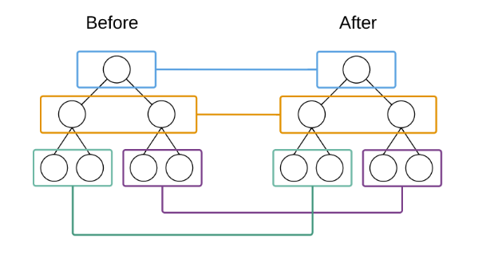

### 什么是DOM diff 算法
web界面由DOM树来构成，当其中某一部分发生变化时，就是对应某个dom节点发生变。在react中，构建UI界面的思路是由当前状态决定界面。前后两个状态就对应两套界面，然后由react来比较连个界面的区别，这就需要对DOM树进行diff算法分析。

Facebook 工程师结合web界面的特点做出了两个假设，使得diff 算法的复杂度降到了O(n)
 > 1. 两个相同组件产生类似的DOM结构。不同的组件产生不同的DOM结构
  2. 对于同一层次的子节点，它们可以通过唯一的ID进行区分

### 不同节点类型的比较
在React中比较两个虚拟DOM节点，当两个节点不同时，应该如何处理这分两种情况：
 - 节点类型不同
 - 节点类型相同，但属性不同

#### 节点类型不同
 当在树中同一位置前后输出了不同类型的节点，React直接删除前面的节点，然后创建并插入新的节点 

#### 逐层进行节点比较
在React中，树的算法非常简单，两棵树只会对同一层次节点进行比较
 
React 只会对相同颜色方框的DOM节点进行比较，即同一父节点下的所有子节点。当发现节点已经不存在，则该节点及其子节点会被完全删除掉，不会用于进一步的比较。这样只需要对树进行一次遍历就完成整个DOM树的比较

### 相同类型节点的比较
React 会对属性进行重设从而实现节点的转换。

列表节点的比较
处于同一层的节点，即使他们完全一样，也会销毁并重新创建。
对于列表节点，提供唯一的可以属性，可以帮助react定位到正确节点进行比较，从而大幅减少DOM操作次数，提高了性能。